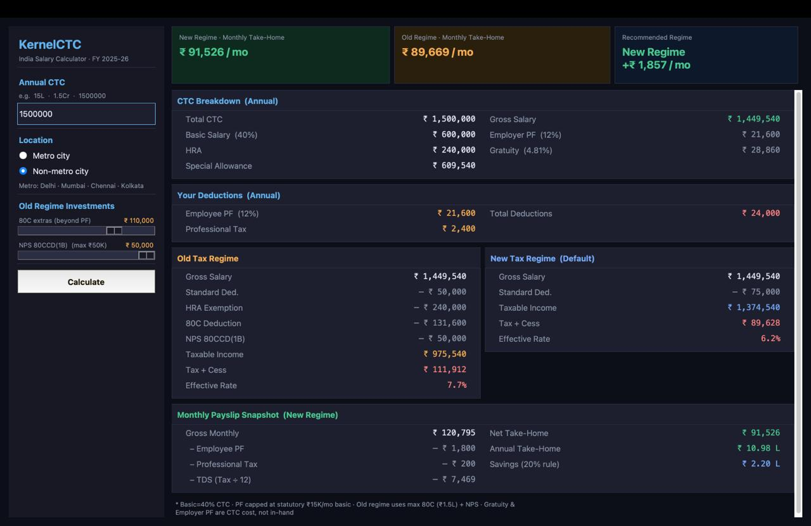

# KernelCTC

> India Salary Calculator · FY 2025-26



KernelCTC is a desktop app that takes your annual CTC and breaks it down completely — in-hand salary, PF deductions, gratuity, HRA exemption, and your full tax liability under both the Old and New tax regimes. No spreadsheets, no manual math. Enter your CTC, hit Calculate, and get a clean structured breakdown in seconds.

It includes an animated splash screen, a dark-themed UI, and supports shorthand input like `15L`, `1.5Cr`, or `1500000`.

---

## What you get

- **CTC Structure** — Basic (40%), HRA, Special Allowance, Employer PF, Gratuity
- **Your Deductions** — Employee PF (capped at statutory ₹15K/mo basic) + Professional Tax
- **Old Regime** — Standard Deduction, HRA exemption, 80C, NPS 80CCD(1B), tax + cess
- **New Regime** — Standard Deduction of ₹75,000, tax + cess, effective rate
- **Regime Comparison** — side-by-side monthly take-home with a clear recommendation
- **Monthly Payslip Snapshot** — gross → deductions → net take-home, annual total, savings estimate

---

## Tech Stack

| Layer | Technology |
|---|---|
| Language | Python 3.10+ |
| GUI Framework | `tkinter` (built into Python — zero install) |
| Animations | tkinter `Canvas` with manual frame loop |
| Tax Logic | Pure Python — slab calculation, surcharge, 4% cess |
| Packaging | Single file · no dependencies |

---

## Quickstart

**1. Check Python is installed**

```bash
python3 --version
```

Requires Python 3.10 or higher.

**2. Install tkinter** (only needed on Homebrew Python on macOS)

```bash
# macOS with Homebrew Python 3.14
brew install python-tk@3.14

# Ubuntu / Debian
sudo apt install python3-tk
```

> If you installed Python from python.org, tkinter is already included.

**3. Clone the repo**

```bash
git clone https://github.com/your-username/salary-calculator-india.git
cd salary-calculator-india
```

**4. Run**

```bash
python3 kernelctc.py
```

That's it. No `pip install`, no virtual environment, no config.

---

## Input formats

| You type | Interpreted as |
|---|---|
| `15L` | ₹ 15,00,000 |
| `1.5Cr` | ₹ 1,50,00,000 |
| `750000` | ₹ 7,50,000 |
| `15,00,000` | ₹ 15,00,000 |

---

## Assumptions

- Basic Salary = 40% of CTC
- HRA = 50% of Basic (metro) or 40% (non-metro)
- Employee PF capped at statutory ₹15,000/month basic = ₹21,600/year
- Old Regime: max 80C (₹1.5L total including PF) + NPS 80CCD(1B) up to ₹50K
- Professional Tax = ₹2,400/year
- Surcharge applied for income above ₹50L · 4% Health & Education Cess on all tax

---

## Screenshots

Add your screenshots to the `assets/` folder and update the path at the top of this file.

---

## License

MIT
